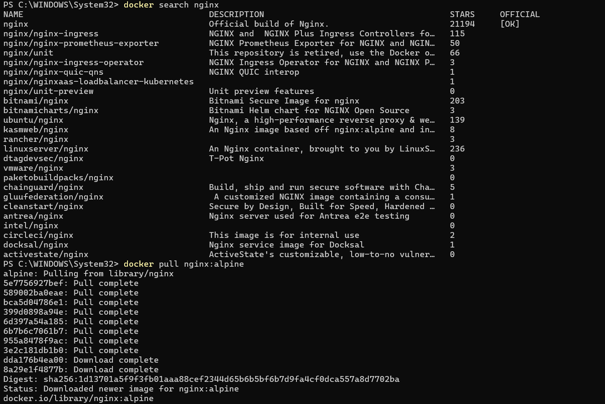
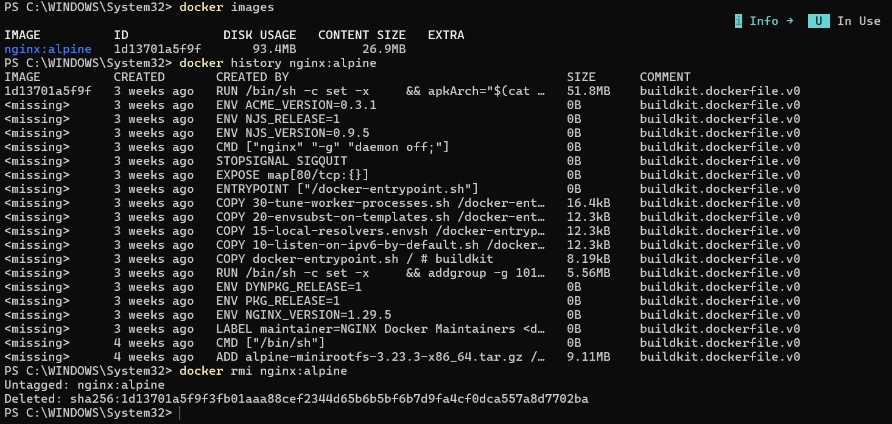
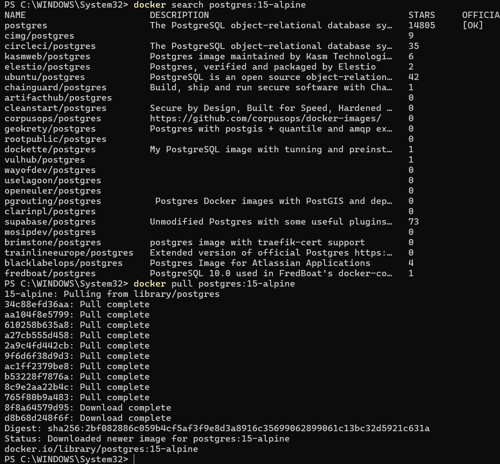
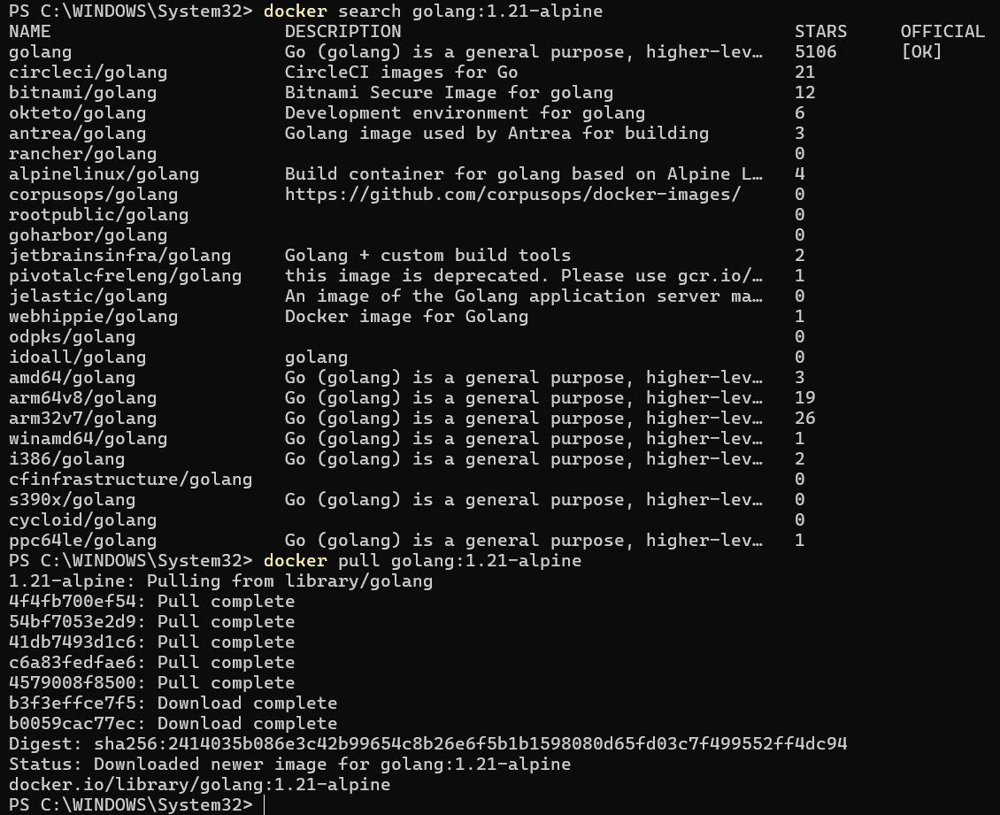
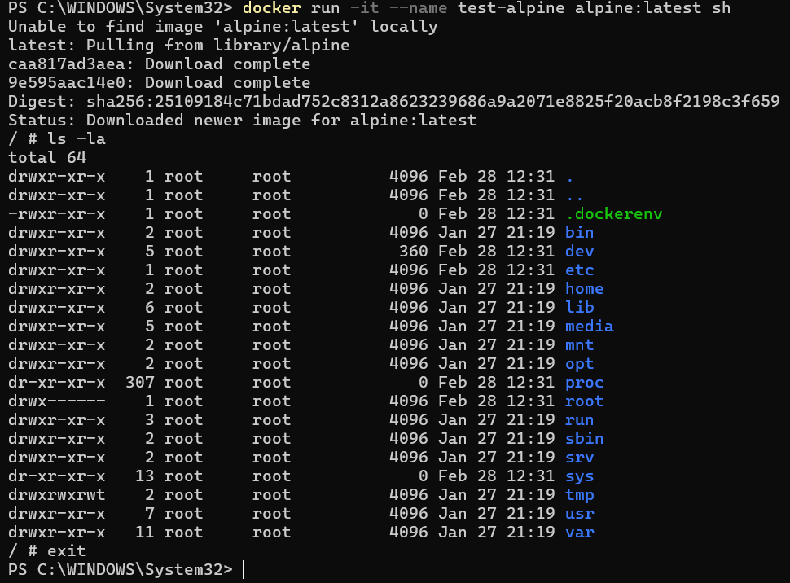
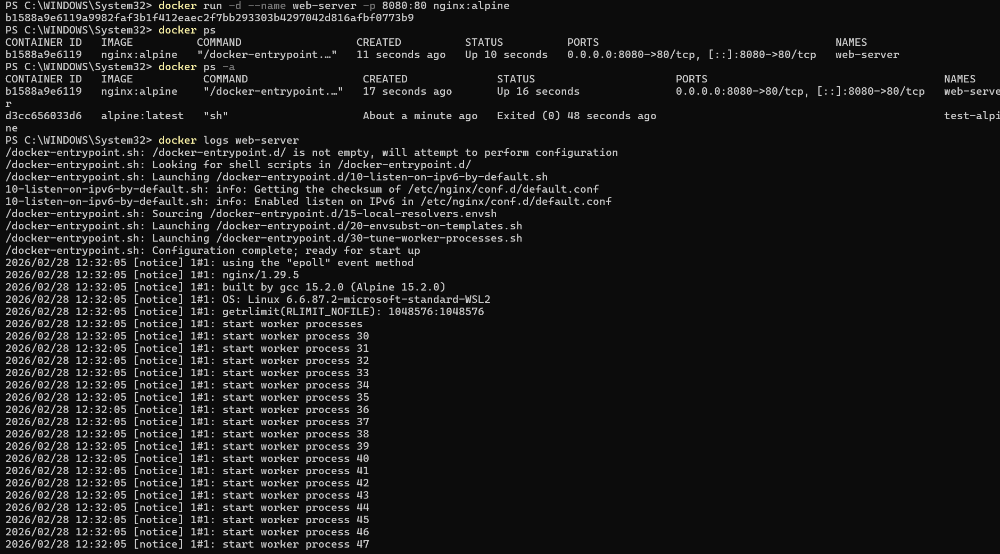
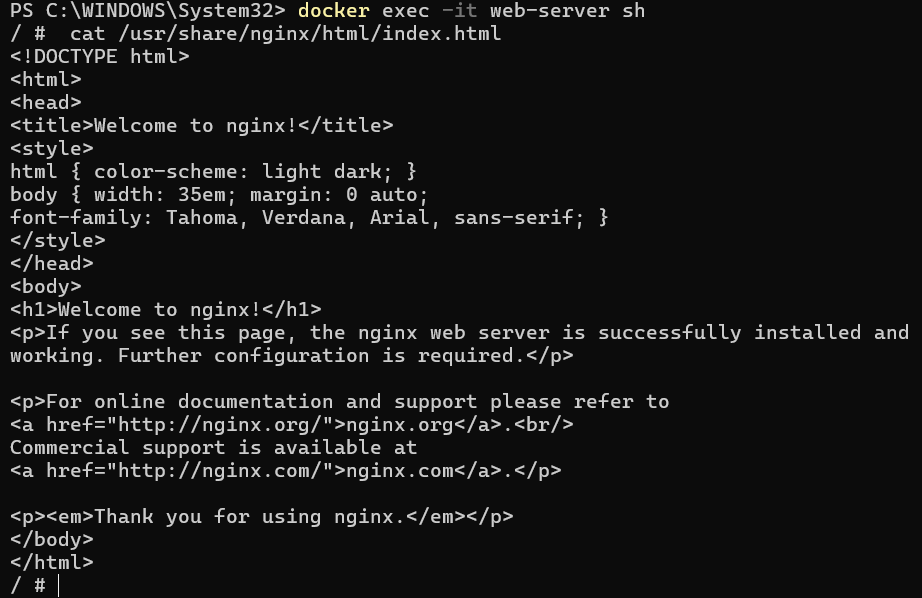
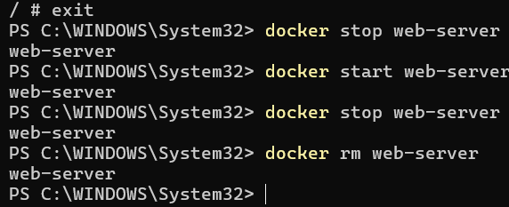
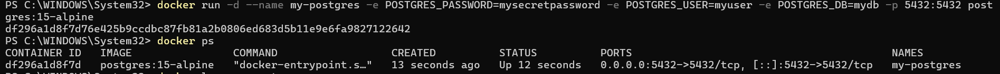
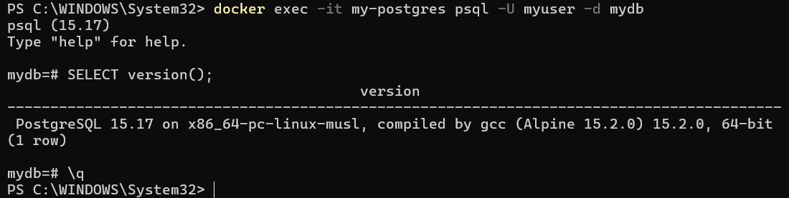

# Отчет по практической работе №1
## Студент: [ФИО]
## Группа: [номер группы]
## Дата выполнения: [дата]
### 1. Выполненные команды Docker
#### 1.1 Работа с образами




#### 1.2 Работа с контейнерами










#### 1.3 Работа с томами
```
[вставьте вывод docker volume ls либо скриншоты]
```
### 2. Скриншоты работающего приложения
#### 2.1 Главная страница

#### 2.2 Добавление пользователя

#### 2.3 Список пользователей в БД

### 3. GitHub Actions
#### 3.1 Успешный запуск workflow

#### 3.2 Опубликованные образы в GHCR

### 4. Выводы
[Опишите, что нового узнали, с какими трудностями столкнулись]
